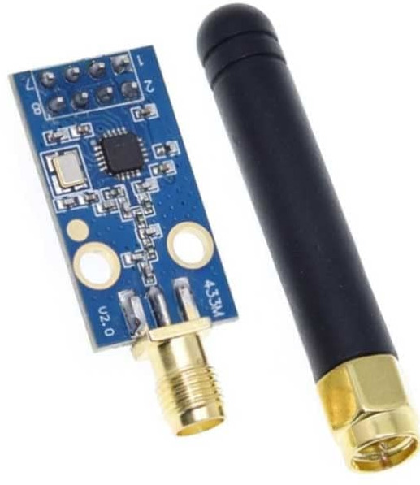
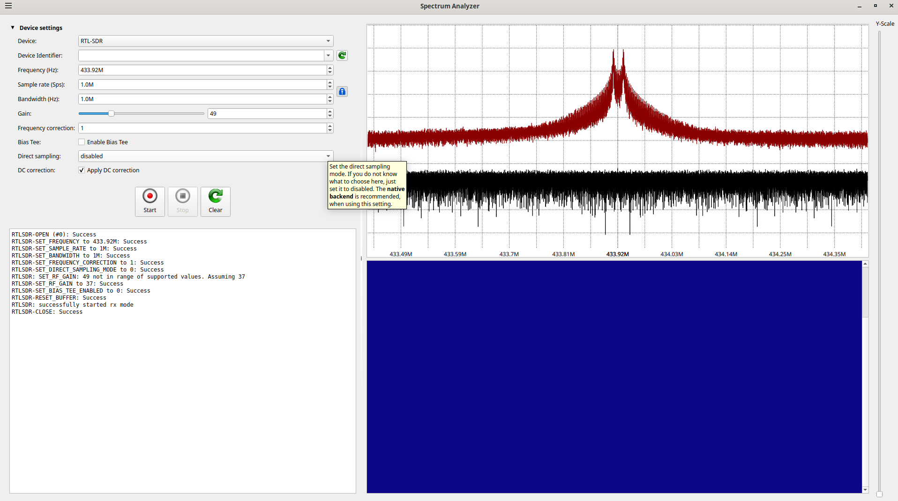

# Quiet Cool RF Remote with ESPHOME
Operate your remote controlled QuietCool Fan from ESPHome or Arduino.


This project implements an RF remote control system for Quiet Cool fans using an ESP32 microcontroller and CC1101 RF module.
The system can control various fan speeds and modes through RF signals.


# TL;DR -- get it running on ESPHome
Get a generateic CC1101 board.  Like this [CC1101 Board](https://www.amazon.com/dp/B0D3W9GVRQ?ref=ppx_yo2ov_dt_b_fed_asin_title)




Make these connections from your ESP32 to your CC1101 chip/board.

NOTE: the pinouts on these boards seem to be not reliable.  I had to trace them manually to figure out which header pin went to which CC1101 pin.  

| Module Pin | CC1101 Pin Name | CC1101 Pin #| ESP32 Pin |
|------------|-----------------|-------------|-----------|
| 1          | GND             | 16,19,PAD   | GND       |
| 2          | VCC             | -           | 3.3V      |
| 3          | GDO0            | 6           | GPIO13    |
| 4          | CSn             | 7           | GPIO15    |
| 5          | SCK             | 1           | GPIO18    |
| 6          | MOSI            | 20          | GPIO23    |
| 7          | MISO            | 2           | GPIO19    |
| 8          | GDO2            | 3           | GPIO12    |


## TL;DR -- get it running on ESPHome from ESPHome Builder on HomeAssistant

* Go to ESPHome Builder
* Click "+ NEW DEVICE" at the bottom of the screen
* Click `CONTINUE`
* name your fan
* click the ESP32 type you have.
* click `SKIP`
* on your new entry, click `EDIT`
* add the following to the bottom of the file:
```
spi:
  clk_pin: 18
  mosi_pin: 23
  miso_pin: 19

external_components:
  - source:
      type: git
      url: https://github.com/ccrome/quiet-cool-rf-remote.git
      ref: main
    components: [ quiet_cool ]

fan:
  - platform: quiet_cool
    name: QuietCool fan
    cs_pin: 15
    gdo0_pin: 13
    gdo2_pin: 12
```
* click `INSTALL` and install it in the normal ESPHome ways...

## TL;DR -- get it running on ESPHome, building locally

Create a `secrets.yaml` file
```secrets.yaml
wifi_ssid: <ssid>
wifi_password: <wifi password>
api_enctryption_key: <api key>
ota_password: <ota password>
```


compile, upload, and run
```
esphome compile quietcool-fan-example.yaml && \
esphome upload --device /dev/ttyUSB0 quietcool-fan-example.yaml  && \
esphome logs --device /dev/ttyUSB0 quietcool-fan-example.yaml
```

If everything is working, you should see
```
[16:48:24][D][quietcool:168]: gdo0_pin = 13, gdo2_pin = 12
[16:48:24][I][quietcool:174]: Starting CC1101 setup
[16:48:24][D][quietcool:041]: sck:18, miso:19, mosi:23, csn:15
[16:48:24][I][quietcool:047]: CC1101 VERSION READ: 0x00
[16:48:24][I][quietcool:047]: CC1101 VERSION READ: 0x14
[16:48:24][I][quietcool:049]: CC1101 detected!
[16:48:24][I][quietcool:179]: CC1101 ready
[16:48:24][D][empty_fan.fan:022]: QuietCool initialized
```

# Run it on arduino
The arduino code doesn't do much by itself.  But it gets you going:

```
cd arduino
platformio run --target upload
```

## Hardware Requirements

- ESP32 DOIT DevKit V1
- CC1101 RF Module
- Wiring connections as follows:
  ```
  CC1101 Pin -> ESP32 Pin
  GND       -> GND
  VCC       -> 3.3V
  GDO0      -> GPIO13
  CSn       -> GPIO15
  SCK       -> GPIO18
  MOSI      -> GPIO23
  MISO      -> GPIO19
  GDO2      -> GPIO12
  ```

## Case
Here's a case for the parts that I used.

The source is here [in OnShape](https://cad.onshape.com/documents/23ba2be84b2f4dcf9bfd73fc/v/3fa4bea9b4bb4353b99b35e1/e/0985333c7a3d43ad0383c966)

### Step File

* The whole design: [QuietCoolCase.step](3d/step/QuietCoolCase.step)
* Or just the Top: [QuietCoolCaseTop.step](3d/step/QuietCoolCaseTop.step)
* and just the Bottom: [QuietCoolCaseBottom.step](3d/step/QuietCoolCaseBottom.step)

## Software Requirements

- PlatformIO


## Features

- Controls Quiet Cool fan system via RF signals
- Supports multiple fan speeds and timer durations
  - Speed
    - L
    - M
    - H
  - Duration
    - 1
    - 2
    - 4
    - 8
    - 12
    - off
    - on

# Reverse Engineering
I used an RTL-SDR.COM SDR like this:


And for software, I used Universal Radio Haacker.  Here's a recording of all the signals as they progress from H 1 2 4 8 12 ON OFF -> to medium -> low.  It was recorded with these settings


[Download the raw recording](recordings/RTL-SDR-20250510_080358-433_92MHz-1MSps-1MHz.complex16s.gz)




## Modulation
This remote uses FSK modulation at 433.92MHz.  The CC1101 RF module ended up transmitting high, so I reduced the frequency in the code to 433.897 to make it work.  If things don't work, check the actual frequency.


## Configuration

The system operates at 433.897 MHz and uses FSK modulation. The CC1101 module is configured for:
- Direct mode transmission
- No packet handling
- Raw data mode
- No CRC or preamble

## Building and Uploading

```pio run --target upload```

# TODO
* Implement the timers in the esphome UI

## License
MIT License

## Contributing

Contributions are welcome! Please feel free to submit a Pull Request.
